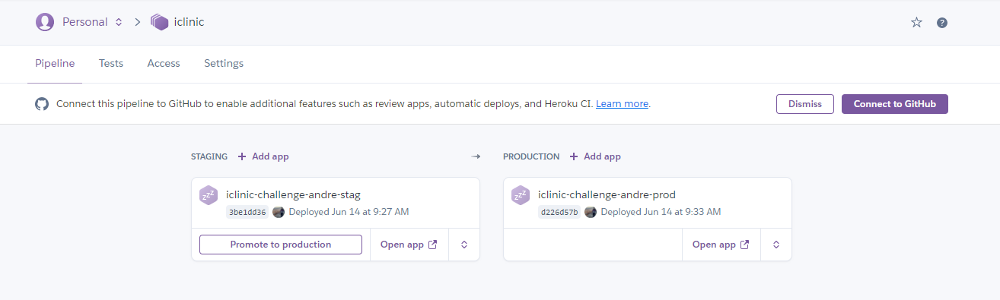
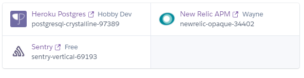

"# IClinic Challenge"

Esse projeto, eu criei dois ambientes, staging e production.

Ambos os ambientes estão com a mesma configuração

Os recursos que utilizei são:

Heroku Postgres -> Banco de dados  

New Relic APM -> Para monitoria da aplicação e análise de erros 

Sentry -> Para monitoria das exceções da aplicação  

